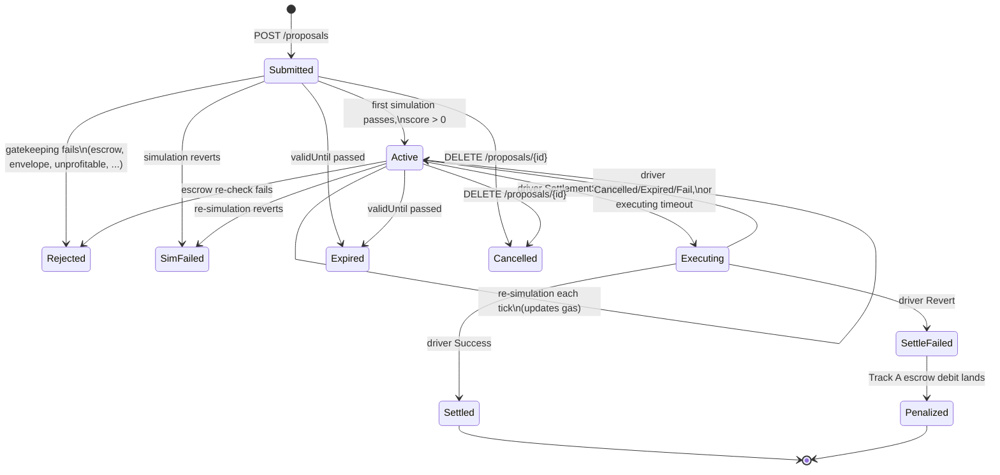

# Proposal lifecycle & retention

Status: accepted

## Context

The proposal state machine grew by accretion: `Submitted → Active` plus five terminal states, defined in `domain/proposal.rs` and described piecemeal across ADR-0001 (ingestion, persistence), ADR-0012 (simulation, re-validation), and ADR-0010 (settlement outcomes). Several things were missing or wrong as of 2026-07:

- **Nothing ever set `Settled`.** The state existed in the enum and the audit mapping, but no code path reached it — ADR-0010's outcome source was still a proposed driver fork.
- **Nothing happened between winning and the outcome.** A proposal picked by `/solve` stayed `Active`: it kept being re-simulated (and could flip to `SimFailed` because our own pending settlement was about to consume its balances) and kept being offered to the next auction while a settlement built on it was in flight.
- **Terminal proposals never left memory** (COW-1177): pruned from the secondary indexes, retained in the main map forever.
- **`validUntil` was unbounded.** Ingestion rejected timestamps in the past but accepted any future value, so one proposal could pin an `eth_estimateGas` per tick for the life of the process. ADR-0001's restart story ("short proposal lifetimes") was an assumption, not an invariant.
- **Retention was deliberately deferred.** ADR-0001 committed to a 3-month floor for audit evidence and punted the rest to "a separate decision". This is that decision.
- **The ingestion-time profitability gate** (ADR-0002 Q7) was decided in the 2026-07 review — reject unprofitable proposals — but had no write-up and no defined place in the lifecycle.

One discovery reshaped the settlement half: the stock CoW driver already notifies its solver engine per solution (`/notify` with `SettlementStarted`, `Success{transaction}`, `Revert{transaction}`, `Cancelled`, `Expired`, `Fail`, and several pre-submission rejection kinds, each carrying auction and solution ids). No driver fork is needed to observe outcomes — ADR-0010 is rewritten accordingly.

## Decision

### The state machine

Every transition, in one place:

| From | To | Trigger |
|---|---|---|
| — | `Submitted` | `POST /proposals`: signature verified, expiry window OK; stored for background validation. |
| `Submitted` | `Active` | First validation passes: escrow check, envelope check, simulation succeeds, score > 0. Writes `gas_used`, `trampoline`, token addresses. |
| `Submitted` | `Rejected` | A gatekeeping rule fails: `InsufficientEscrow`, `UnsupportedOrder`, `AmountMismatch`, `OrderNotFound`, or `Unprofitable` (score ≤ 0 at first simulation). Carries the typed `rejectionReason`. |
| `Submitted` | `SimFailed` | First simulation reverts. |
| `Active` | `Active` | Re-validation tick: fresh simulation refreshes `gas_used`. No status change, no audit event. |
| `Active` | `Rejected` | Escrow re-check fails on re-validation (balance dropped below the threshold). |
| `Active` | `SimFailed` | Re-simulation reverts (order filled or expired on-chain, route broke, balances moved). |
| `Submitted`, `Active` | `Expired` | Expiry sweep: `validUntil` is behind the clock. |
| `Submitted`, `Active` | `Cancelled` | Signed `DELETE /proposals/{id}` by the owner. `DELETE` against any other state is a `409`. |
| `Active` | `Executing` | Driver `/notify SettlementStarted`: our solution won and the settlement tx is being submitted. |
| `Executing` | `Settled` | Driver `/notify Success { transaction }`: the tx landed. Tx hash recorded. |
| `Executing` | `SettleFailed` | Driver `/notify Revert { transaction }`: the tx reverted on-chain. Tx hash recorded; the Track A debit follows ([ADR-0010](0010-settlement-outcome-source.md)). |
| `Executing` | `Active` | Driver `/notify Cancelled`/`Expired`/`Fail` (submission abandoned, no tx landed), or `--executing-timeout` elapsed (lost notification, restart mid-settlement). The proposal re-enters competition; if the order is actually gone, re-simulation kills it. |
| `SettleFailed` | `Penalized` | The Track A escrow debit lands on-chain. `penalty_tx_hash` recorded. |

A state answers one question: what does the service do with the proposal right now?

| State | Simulated | Offered to `/solve` | Expiry sweep | Cancellable | Exits | Retention |
|---|---|---|---|---|---|---|
| `Submitted` | first pass | no | yes | yes | verdict, expiry, cancel | — (live) |
| `Active` | every tick | yes (needs `gas_used`) | yes | yes | verdict, expiry, cancel, `SettlementStarted` | — (live) |
| `Executing` | no | no | no | no | driver notification or timeout | — (live) |
| `Rejected` | no | no | — | no | none | 1 hour |
| `SimFailed` | no | no | — | no | none | 1 hour |
| `Expired` | no | no | — | no | none | 1 hour |
| `Cancelled` | no | no | — | no | none | 1 hour |
| `Settled` | no | no | — | no | none | indefinite |
| `SettleFailed` | no | no | — | no | `Penalized` when the debit lands | indefinite |
| `Penalized` | no | no | — | no | none | indefinite |

`Executing` is exempt from the expiry sweep on purpose: the chain enforces the order's real deadline, and the proposal's exit is the driver notification (or the timeout below), not the wall clock.

### Auction participation: losses are events, states are for winners

A proposal that loses an auction — outscored internally at `/solve`, or our solution losing the external CoW competition — is still a valid, executable proposal for the next auction. Losing is therefore **not a state**: the proposal stays `Active` and keeps competing. Participation is recorded as data (the `solutions` table below plus audit events), so "which auctions did this proposal compete in and lose" is a query, not a status.

Winning is a state change, because it changes what the service does: once the driver starts submitting a settlement built on the proposal, we must stop offering it and stop re-simulating it.

### `Executing`: entered and exited by driver notifications

BYOS implements the solver-engine `/notify` endpoint and maps notifications to transitions:

| Notification | Transition |
|---|---|
| `SettlementStarted` | `Active → Executing` |
| `Success { transaction }` | `Executing → Settled` (tx hash recorded) |
| `Revert { transaction }` | `Executing → SettleFailed` (tx hash recorded; Track A follows, ADR-0010) |
| `Cancelled`, `Expired`, `Fail` | `Executing → Active` — the tx never landed; the proposal re-enters competition. Queues the `0.1 × c_l` non-settlement debit ([ADR-0003](0003-slash-attribution-flow.md)) |
| pre-submission kinds (`SimulationFailed`, `EmptySolution`, ...) | no transition; recorded as audit events |

`Executing` is entered on `SettlementStarted`, not at `/solve` time — at `/solve` time we don't yet know we won. The window between the autopilot picking our solution and `SettlementStarted` arriving is accepted: it is sub-second-to-seconds, and inventing a "won but not yet submitting" state isn't worth it.

Two safety properties:

- **`Executing → Active` is always safe.** If the order was actually consumed (our tx landed but the notification was lost, or the order was filled externally), the next re-simulation reverts and the proposal dies as `SimFailed`. Re-simulation is the truth-teller.
- **Timeout backstop.** An `Executing` proposal older than `--executing-timeout` (default 5 minutes) falls back to `Active` — covering lost notifications and restarts mid-settlement. Same argument as above: if it really settled, re-simulation kills it within a tick.

### Simulation stops at the first revert

Unchanged from ADR-0012, now with the lifecycle rationale written down: the first re-simulation revert flips the proposal to `SimFailed`, terminal, no strikes, no retry. A proposal that reverted once is not robust enough to offer to `/solve` — if it won and then reverted on-chain, the sub-solver takes a Track A penalty, which is strictly worse for them than resubmitting. Transient transport errors still defer rather than fail. Resubmission is the sub-solver's "I still believe in this route" signal.

### Profitability gate: first simulation, not re-validation

Settles ADR-0002 Q7 (decided in the 2026-07 review). On the first simulation (the `Submitted → Active` gate), the proposal is scored (`score = surplus − gas`, ADR-0002) with the simulated gas and current gas price. A score of zero or less rejects with the new `RejectionReason::Unprofitable` — matching `/solve`'s own `score > 0` inclusion rule, so one invariant holds: an `Active` proposal is one that could win an auction right now.

The gate is **not re-applied on re-validation**. Gas prices wobble; rejecting an `Active` proposal on a spike would churn proposals that are profitable again two blocks later. `/solve` re-scores with fresh gas at auction time, so an unprofitable-right-now proposal cannot leak into a solution — it just idles, bounded by the lifetime cap below.

### Proposal lifetime is capped at ingestion

`POST /proposals` rejects any `validUntil` more than `--max-proposal-lifetime` (default 5 minutes) in the future. This bounds worst-case simulation cost per proposal — the expiry sweep is the natural "stop simulating" point and is now guaranteed to arrive — and turns ADR-0001's "short proposal lifetimes" assumption into an enforced invariant. Sub-solvers already run polling loops; re-signing a fresh proposal every few minutes is trivial, and a route priced longer ago than that is stale anyway.

The *order's* `validTo` needs no separate handling: once the order expires or is filled, simulation reverts (GPv2 checks it) and first-revert-terminal cleans up within a tick.

### `Penalized`: the Track A debit closes the story

When the Track A escrow debit for a `SettleFailed` proposal lands on-chain, the proposal transitions `SettleFailed → Penalized` and records `penalty_tx_hash` — the proposal row itself answers "was this sub-solver charged, and where's the proof". Until the debit lands (retries included), the proposal sits queryable in `SettleFailed`.

Track B stays out of the proposal machine: a CoW ruling months later is an account-level event against the sub-solver, not a transition of one proposal. It lives in escrow accounting and audit events (ADR-0003).

### Storage: Postgres is the proposal store

The in-memory hot store is removed. A `proposals` table in the existing Postgres becomes the single source of truth for current state; `GET`, `/solve`, the validator loop, and `/notify` all read and write it directly.

- **The compare-and-swap transition ports as SQL.** `UPDATE proposals SET status = $to WHERE id = $id AND status = $from` — zero rows affected means the caller's verdict was stale (a cancellation or notification won the race), exactly the in-memory semantics, now durable.
- **No cache, no Redis.** ADR-0001 rejected a DB-backed `/solve` for latency, but the driver gives solvers seconds and an indexed read over a few hundred live rows is ~1 ms. A second store (Redis) or a cache layer is premature until `/solve` measurements say otherwise.
- **IDs become a Postgres sequence.** The reseed-from-audit-trail dance at boot is deleted.
- **Restarts stop being lossy.** Live proposals survive: `Submitted`/`Active` re-validate on the next tick, `Executing` resolves via notification or timeout. Sub-solver resubmission on restart is no longer part of the design.
- **A `solutions` table maps notifications back to proposals**: `(auction_id, solution_id, proposal_id, created_at)`, written synchronously inside `/solve` before the solution is returned — if we can't record it, we don't bid it. `/notify` joins through it; it doubles as the per-auction participation record (a row with no subsequent `SettlementStarted` is a loss).
- **`audit_events` is unchanged**: append-only history and dispute evidence, written behind the same channel. The `proposals` table holds what *is*; `audit_events` holds what *happened*.
- **The write-behind keeps a small crash window.** An audit event is emitted only after its proposal write commits, so a crash between the two leaves a durable state change with no matching event. With the in-memory store the state died with the process, so the two always agreed; now they can diverge by exactly one event per crash. Accepted: closing it means writing evidence in the same transaction as the mutation, which couples every store write to the audit codec and removes the writer's retry/backoff isolation. Revisit if a dispute ever hinges on a single missing event.

### Retention: one sweep, one knob

A background sweep (its own slow loop, every few minutes — no reason to couple it to the per-block validation tick) deletes terminal rows past their window:

- **`Rejected`, `SimFailed`, `Expired`, `Cancelled`: deleted 1 hour after reaching the state** (`--dropped-retention`). Consumers are polling loops that observe the terminal state within one poll interval; an hour is hundreds of intervals. After that the proposal is a 404. `solutions` rows for these proposals go with them.
- **`Settled`, `SettleFailed`, `Penalized`: kept indefinitely.** These are the money states. No sweep code for them at all — a retention window here is an optimization for later, not a launch requirement.
- **`audit_events`: still no deletion path.** The volume math permits it (a few rows per proposal is well under a million rows a year even with aggressive resubmission churn), and it is what keeps rejected-proposal history and auction-loss records queryable after the proposal row is gone. ADR-0001's note stands: any future audit retention policy is its own decision.

## Alternatives considered

- **"Lost auction" as a proposal state.** Rejected — the proposal would bounce `Active → Lost → Active` every auction while remaining fully valid; losing changes nothing about what the service does with it. Events answer the queries.
- **Enter `Executing` at `/solve` time.** Rejected — we don't know we won; every non-winning auction round would need an unwind path.
- **N-strikes or never-terminal `SimFailed`.** Rejected — a once-reverted proposal offered to `/solve` risks an on-chain revert and a penalty for the sub-solver; never-terminal burns an RPC call per tick on dead orders for their whole lifetime. (ADR-0001 records the same rejection as "temporary suspension on simulation failure".)
- **Re-applying the profitability gate on re-validation.** Rejected — gas-price flapping churns proposals that `/solve`'s own auction-time filter already handles.
- **In-memory terminal retention with a TTL (memory-only serving).** Rejected — a restart erases what a sub-solver needs to see about why its proposal died; "in memory at any stage is fragile" was the deciding argument, and it generalized to the whole store.
- **Redis (or any second store) for live proposals.** Rejected as premature — one database is enough at this volume; revisit only with `/solve` latency data.
- **Penalty as audit events only, no `Penalized` state.** Rejected — the debit tx hash belongs on the proposal so "was this charged" is a row lookup, not event-log archaeology.
- **Per-tier deletion windows for the money states (e.g. 90 days aligned to Track B).** Rejected for now to keep the sweep light; indefinite retention of a small set of settled rows costs nothing.

## Consequences

- **BYOS gains a `/notify` endpoint** on the internal listener, and `/solve` gains a synchronous `solutions` insert. Both are prerequisites for `Executing` and everything after it.
- **ADR-0010 is rewritten**: the outcome source is the stock driver's notifications, not a driver fork. Any fork discussion is now about other features only.
- **Breaking API changes for sub-solvers**: `validUntil` more than a few minutes out is rejected at `POST`; dropped proposals 404 an hour after dying; the status vocabulary grows (`executing`, `settleFailed`, `penalized`) and `GET` exposes `penalty_tx_hash` and settlement tx hashes.
- **ADR-0001 is trimmed where this ADR takes over** (lifecycle section, persistence hot-store half, restart consequence — each replaced by a pointer here). The two-listener topology, rate limiting, and authentication are untouched.
- **ADR-0012's re-validation section is edited in place**: only `Submitted` and `Active` simulate; the first pass additionally applies the profitability gate.
- **COW-1177 (terminal-proposal pruning) is resolved** by the retention sweep; the in-memory leak ceases to exist along with the in-memory store.
- **`POST` gets one DB write on the request path** (and `DELETE`/`GET` their reads). The async-ingestion rule from ADR-0001 — no RPC, no simulation on the sync side — still holds; a local indexed insert is not in that class.
- **Simulation load is bounded**: worst case one `eth_estimateGas` per proposal per tick for at most `--max-proposal-lifetime`.
- New configuration: `--max-proposal-lifetime` (default 5m), `--executing-timeout` (default 5m), `--dropped-retention` (default 1h).
